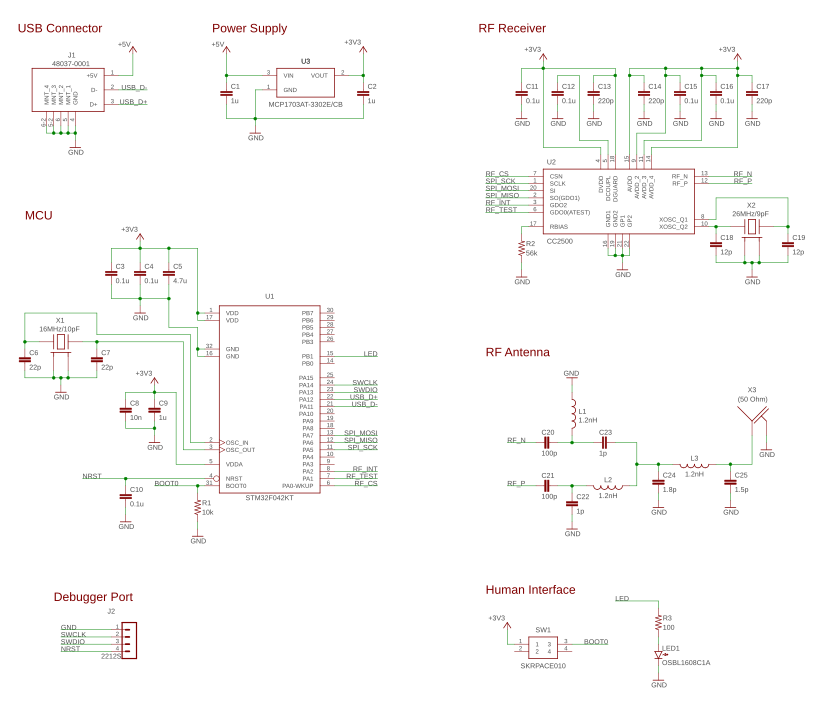

rcstick-f
====


rcstick-f is a USB HID device which has 8 analog axis.
And this device is also a RF receiver which conplient with Futaba S-FHSS protocol.<br>
This device is designed to be used to controll RC flight simulator by Futaba RC transmitter.

One of the most simple and common way to use RC transmitter as controller of RC flight simulator is handling PPM signal exported from the trainer port on a transmitter.<br>
Some simulator software can recognize PPM signal through audio input, So in this case, you have to do is just connect cable between the trainer port on a transmitter and mic input port on a PC.<br>
Or using USB dongle that convert PPM signal to USB HID device, such as [these products](https://www.ebay.com/sch/i.html?_nkw=RC+simulator+USB+dongle+cable&_sacat=0&LH_TitleDesc=0&_osacat=0&_odkw=rc+simulator+usb+dongle), is also popular.<br>
The advantages of these PPM signal based solution are inexpencive and compatibe with many transmitter products. The most disadvantages is that the cable between  a transmitter and PC is very annoying.

On the other hand, in recent years, the products that behave wireless RF receiver and USB HID device have appeared in the world. For example, [SPEKTRUM WS1000](https://www.spektrumrc.com/Products/Default.aspx?ProdID=SPMWS1000) for DSM2/DSMX protocol or [FrSky XSR-SIM](https://www.frsky-rc.com/product/xsr-sim/) for FrSky protocol.<br>
These products are designed for a specific protocol. So comatibility is lower than the PPM signal based solution. However, users can enjoy highly convenience due to wireless connection.<br>
In addition, that is more responsive and higher precision than the PPM signale based solution since there is no unnecessary data conversion such as ADC data to PPM.

The reason why I determined to start this project is that I could'nt find a such kind of wireless device supported Futaba RC protocol.<br>

<p align="center">

</p>

## Futaba S-FHSS protocol
S-FHSS is a 2.4 GHz band based RC transceiver protocol designed by Futaba.
It is not brand new protocol, However many Futaba transmitter suport this protolol. And this protocol is well analyzed. That's why I choose S-FHSS for my own receiver imprementation.

[This commentary article](https://rfengfpv.wordpress.com/2017/01/10/futaba-s-fhss-protocol-overview/) and
[this C source code](https://github.com/DeviationTX/deviation/blob/2ce0f46fe94d80198ae94fd5a6f6a008863ec420/src/protocol/sfhss_cc2500.c)
which impremens S-FHSS transmitter are very helpful to understand the protocol.
I sincerely appreciate there effort.

## PCB Design
I designed two types of PCB artworks for rcstick-f.<br>
One is sufficiently small that QFP32 package of STM32 MCU is installed, the other one is very small that QFN32 package of MCU is installed.

Both artworks are optimized to enable hand soldering by using a soldering iron. You don't need a reflow oven or a hot air gun.<br>
All pads and parts spaceing are designed to allow contacting soldering iron. grand pad located center of QFN package is also able to be soldered through a via from back side of PCB.

<p align="center">

</p>

### Design FIles
Board Type        | Eagle design files | Gerber files 
------------------|--------------------|--------------
QFP32 MCU version | [pcb/small](pcb/small)| [rcstick-f-gerber.zip](https://raw.githubusercontent.com/wiki/opiopan/rcstick-f/data/rcstick-f-gerber.zip)
QFN32 MCU version | [pcb/tiny](pcb/tiny)| [rcstick-f-tiny-gerber.zip](https://raw.githubusercontent.com/wiki/opiopan/rcstick-f/data/rcstick-f-tiny-gerber.zip)

### Schematic Diagram
<p align="center">

</p>

### BOM List

Components | Value / Product Number | Remarks
-----------|------------------------|------------------------------
U1         | STM32F042K6T6 or STM32F042K6U6 |
U2         | TI CC2500              | 
U3         | MCP1703AT-3302E/CB     | SOT-23 LDO
J1         | MOLEX 48037-0001       | USB type A male connector
J2         | MOLEX 53047-0410       | **OPTIONAL for debugging**<br>Firmware downloading can be proceeded by using DFU mode
X1         | 16MHz Crystal (3225)   | load capacitance: 10pF
X2         | 26MHz Crystal (3225)   | load capacitance: 9pF
LED1       | OSBL1608C1A            |
SW1        | ALPS SKRPACE010        |
C1, C2, C9 | 1uF (1005)             |
C3, C4, C10, C11, C12, C15, C16| 0.1uF (1005)           |
C5         | 4.7uF (1005)           |
C6, C7     | 15pF (1005)            | need to change value if X1's load capacitance is not 10pF
C8         | 10nF (1005)
C13, C14, C17| 220pF (1005)
C18, C19   | 12pF (1005)            | need to change value if X2's load capacitance is not 9pF
C20, C21   | 100pF (1005)           |
C22, C23   | 1pF (1005)             |
C24        | 1.8pF (1005)           |
C25        | 1.5pF (1005)           |
R1         | 10k ohm (1005)         | 
R2         | 56k ohm (1005)         |
R3         | 100 ohm (1005)         |
L1,L2,L3   | 1.2nH (1005)           |

### Case Design
You can download [STL data](https://raw.githubusercontent.com/wiki/opiopan/rcstick-f/data/case.zip) of case for tiny version of PCB. That is desined assuming that is printed by resin printer.<br>
Note that PCB thickness should be 1.2mm if you apply this case design.

<p align="center">

</p>

## Building Firmware
1. **Requirements**<br>
[GNU Arm Embedded Toolchain](https://developer.arm.com/open-source/gnu-toolchain/gnu-rm/downloads)
must be installed in a directory indecateed by `PATH` environment variable.

2. **Downloading Source Codes**<br>

    ```shell
    $ git clone https://github.com/opiopan/rcstick-f.git
    ```

3. **Compiling**
    ```shell
    $ cd rcstick-f/firmware
    $ make all
    ```

## Downloading Firmware
You can choose two way to download firmware to rcstick-f board.<br>
One is downloading firmware via SWD by using debugger. rcstick-f exports a SWD I/F at J2 connector.<br>
The other one is downloading it via USB port in DFU mode. You can switch rcstick-f in DFU mode by inserting that to USB port with the button pressed.

### Downloading via Debugger
1. **Preparing Debugger**<br>
    Make sure that a debugger is connected with rcstick-f J2 port and debugger controlling software which behave as GDB server such as OpenOCD is running.

2. **Downloading**<br>
    You can download a firmware by making ```flash``` target with ```DEBUGSERVER``` parameter.
    If debugger controlling software is running same PC, specify ```localhost``` for ```DEBUGSERVER``` parameter.

    ```shell
    $ make DEBUGSERVER=localhost flash
    ```
### Downloading via USB
1. **Install required software**<br>
    Make sure that following software is installed.
    - [dfu-util](http://dfu-util.sourceforge.net)

2. **Switching rcstick-f in DFU mode**<br>
    Insert rcstick-f to USB port with the button (SW1) is pressed.

3. **Downloading**<br>
    You can download just by making ```dfuflash``` target.

    ```shell
    $ make dfuflash
    ```

4. **Exsiting from DFU mode**<br>
    Pull out rcstick-f from USB port, then re-insert that to USB port.


## How to use rcstick-f
0. Make sure that the settings of transmitter are appropriate as [next section](#transmitter-settings).

1. Insert rcstick-f to USB port of your PC, and make sure that 
    LED on rcstick-f flashes twice every two seconds.

2. Turn on the power of RC transmitter, and make sure that transmitter protocol is S-FHSS.<br>
    When rcstick-f detect that radio waves, LED flashing pattern is changed that flash once every one second.

3. Wait until LED will light continuously that means rcstick-f is binded with RC transmitter.

4. Now you can use your RC transmitter as a joystick on your PC.<br>
    Each channel of S-FHSS transmitter is mapped to each USB HID axis as below.

    Channel  | USB HID usage
    ---------|---------------
    CH 1     | X
    CH 2     | Y
    CH 3     | Z
    CH 4     | X rotation
    CH 5     | Y rotation
    CH 6     | Z rotation
    CH 7     | Slider
    CH 8     | Slider

## Transmitter Settings
I recommend you to register a dedicated model for rcstick-f in your transmitter. That model should be satisfy following conditions.

- **Communication Protocol (REQUIRED)**<br>
    Choose ```S-FHSS``` for communication protocol since rcstick-f can recognize only S-FHSS protocol.
    <p align="center">
    
    </p>

- **End Point (RECOMMENDED)**<br>
    Set end point for each channl as that rx PWM output pulse width will be in range between 1009us and 2031us.<br> 
    In S-HFSS packet, each channel position is expressed as 12 bit number. And that values are equivalent of PWM pulse width output from rx in microsecond. So value of a channel which is on center position will be 1520.<br>
    rcstick-f generates values for each axis of USB HID by subtracting 1520 from value in S-HFSS packet, and clips values in range of 10 bit 2's complement number, that is  between -511 to 511.<br>
    Therefore, the most efficient setting of end point is that each channel value will be in range between 1520 - 511 and 1520 + 511.<br>

    In case of [Futaba 10J](https://www.rc.futaba.co.jp/english/propo/air/10j.html), the end point settings satisfied above condition are 124% or 125% for channels 1 to 4 and 92% or 93% for channels 5 to 8.

    rcstick-f provides a helper function to determine proper endpoint ratio. Refer the [next section](#function-to-detect-value-clipping) for the details.

    <p align="center">
    
    </p>

- **Servo Reverse (RECOMMENDED)**<br>
    In order to prevent runaway when flight simulate is started without a connection between rcstick-f and transmitter, rcstick-f set throttle axis value correspond to channel 3 as -511 that is minimum value in range of each axis.<br>
    For Futaba transmitter, the more you raise the throttle stick, the more transmitter shorten the PWM pulse width. So to align default value the above, enable servo reversing of channel 3.

    <p align="center">
    
    </p>

## Function to detect value clipping
As mentioned previous section, setting end point ratio as largest value within the range expressiblee by rcstick-f is important. To determine that appropriate end point ratio, rcstick-f has a mode to detect clipping value for channel. <br>
Find the appropriate end point ratio as following steps.

1. **Preparing**<br>
    To ensure that movable area of servo exactly maches end point setting, make sure following settings for each channel.

    - Trim and Sub trim: should be reset
    - Dual Rate: should be 100%
    - No mixing with other channels
    - Throttle curve and Pitch curve: should start from 0% and  end to 100%

    Then, make position of all sticks, slide levers, and switches associated with channels 1 to 8 center.<br>
    If that is impossible due to association with 2 position switch, reduce end point ratio significantry for that channel.

2. **Binding rcstick-f and transmitter**<br>
    Bind transmitter with rcstick-f according to steps described in the section ["How to use rcstick-f"](#how-to-use-rcstick-f).<br>

3. **Changing mode of rcstick-f**<br>
    Press a button on the rcstick-f in order to enable a function to detect value clipping. LED on the rcstick-f will flash three times in one second.<br>
    If LED still light continuously, a channel vallue is larger than 1520 + 511 or less than 1520 - 511 at least. Make sure that all channel settings are satisfied conditions mentiond in step 1.

4. **Determining enb point ratio**<br>
    Choose any one channel, then move the stick, the slide bar, or the switch assosiated with taht channel to the maximum position or minimum position.<br>
    If LED is still flashing, the value of cahnnel is in range and is not clipped. In this case, increase end point ratio by 1% until LED is flashing.<br>
    If LED flashing pattern is changed that it light continuously, the value of channel is out of range and is clipped. In this case, decrease end point ratio by 1% by LED start to flash.<br>

    Usually, you can apply same ratio determined above for all other channels. However you should be careful if your transmitter is entry model such as [10J](https://www.rc.futaba.co.jp/english/propo/air/10j.html).<br>
    It's well known taht servo angle in 100% end point for channels 5 and later is wider than the servo angle for channels 1 to 4 in some Futaba transmitter. If you use that kind of transmitter, you need to determine for two channels at least.
